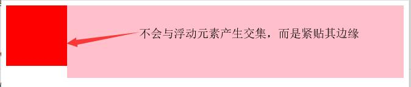

# BFC--块级格式化上下文

## 什么是BFC？

BFC就是一个独立的渲染区域，**只有Block-level box参与**，它规定了内部的Block-level box如何布局，并且与这个区域外部**毫不相干**。

更直白地说：在这个区域中你想怎么玩儿就怎么玩儿，对区域外没有任何影响。


## 创建BFC的条件

- `<html>`元素
- 浮动元素(float不为none)
- position为absolute或fixed
- display属性值为：block、fixed、inline-block、table-cell、table-caption、flow-root等
- ==overflow属性值不为visible==
- flex和grid布局的直接子元素
- 多列容器


## BFC的特性

1. margin重叠只会发生在属于同一个BFC区域的元素上。
2. 浮动元素的高度也会计算入BFC区域的高度。
3. BFC区域不会与浮动元素产生交集，而是紧贴浮动元素的边缘。


## BFC的使用方向

- 浮动定位与清除浮动

  > 浮动和清除浮动只会应用于**同一个BFC区域内**的元素，浮动不会影响其他BFC中的元素的布局。

  

- 防止外边距重叠

  > 外边距重叠只会发生在属于同一个BFC的块级元素之间。

  

- 右侧自适应布局

  ```html
  <style type="text/css">
      .left{
          width: 100px;
          height: 100px;
          background-color: red;
          float: left;
      }
      .right{
          height: 120px;
          background: pink;
          overflow: hidden; /*产生BFC效果*/
      }
  </style>
  
  <body>
  	<div class="left"></div>
  	<div class="right"></div>
  </body>
  ```

  

  此时左侧宽度固定，右侧自适应变化。


## 备注

当我们需要BFC效果来完成某些效果时，推荐使用`overflow：hidden`来产生BFC效果，因为它的**副作用是最小**的。不过在使用它是最好注释下它是用来产生BFC效果的，而不是其他的用途。

