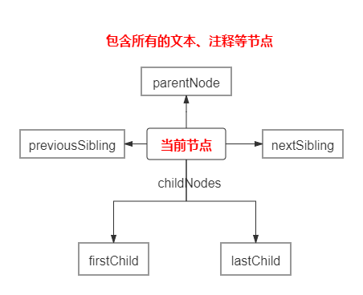
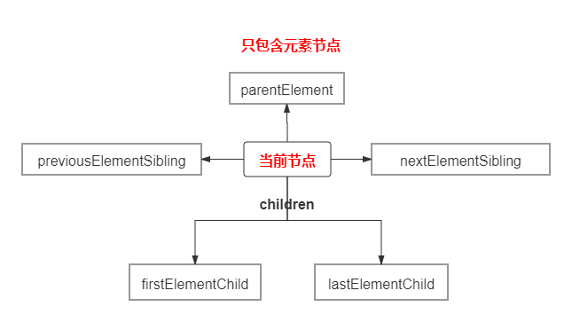

# DOM节点遍历

## 各类型节点遍历
### 图示

### [Node.parentNode](https://developer.mozilla.org/zh-CN/docs/Web/API/Node/parentNode)
返回指定节点在DOM树中的**父节点**。    
`parentNode`是指定节点的父节点。一个元素节点的父节点可能是一个元素(`Element`)节点,也可能是一个文档(`Document`)节点,或者是文档碎片(`DocumentFragment`)节点。

### [Node.previousSibling](https://developer.mozilla.org/zh-CN/docs/Web/API/Node/previousSibling)

返回当前节点的前一个兄弟节点,没有则返回`null`。

### [Node.nextSibling](https://developer.mozilla.org/zh-CN/docs/Web/API/Node/nextSibling)

返回当前节点的紧跟的兄弟节点,没有则返回`null`。

### [Node.childNodes](https://developer.mozilla.org/zh-CN/docs/Web/API/Node/childNodes)

返回包含所有子节点的集合，该集合为即时更新的集合。

### [Node.firstChild](https://developer.mozilla.org/zh-CN/docs/Web/API/Node/firstChild)

返回当前节点的第一个子节点，如果无子节点，则返回 `null`。

### [Node.lastChild](https://developer.mozilla.org/zh-CN/docs/Web/API/Node/lastChild)

返回当前节点的最后一个子节点，如果无子节点，则返回 `null`。

  

## 元素节点遍历

### 图示

### [Node.parentElement](https://developer.mozilla.org/zh-CN/docs/Web/API/Node/parentElement)

返回当前节点的父元素节点，如果该元素没有父节点，或者父节点不是一个 DOM `元素`，则返回 `null`。

### [Element.children](https://developer.mozilla.org/zh-CN/docs/Web/API/ParentNode/children)

返回 一个Node的子[`elements`](https://developer.mozilla.org/zh-CN/docs/Web/API/Element) ，是一个动态更新的 [`HTMLCollection`](https://developer.mozilla.org/zh-CN/docs/Web/API/HTMLCollection)。

### [Element.previousElementSibling](https://developer.mozilla.org/zh-CN/docs/Web/API/NonDocumentTypeChildNode/previousElementSibling)

返回当前元素在其父元素的子元素节点中的前一个元素节点。如果该元素已经是第一个元素节点,则返回`null`。

### [Element.nextElementSibling](https://developer.mozilla.org/zh-CN/docs/Web/API/NonDocumentTypeChildNode/nextElementSibling)

返回当前元素在其父元素的子元素节点中的后一个元素节点。如果该元素已经是最后一个元素节点,则返回`null`。

### [Element.firstElementChild](https://developer.mozilla.org/zh-CN/docs/Web/API/ParentNode/firstElementChild)

返回当前节点的第一个子元素， 如果没有子元素，则为null。

### [Element.lastElementChild](https://developer.mozilla.org/zh-CN/docs/Web/API/ParentNode/lastElementChild)

返回当前节点的最后一个子元素， 如果没有子元素，则为null。
