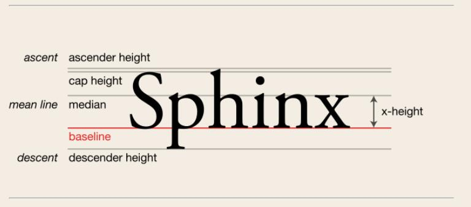
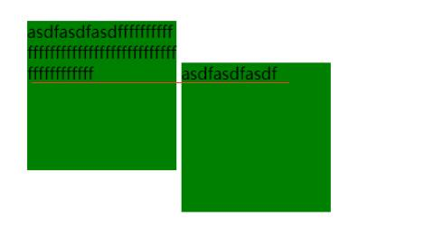
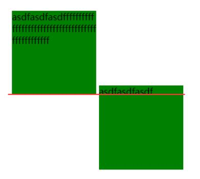

# IFC--内联格式化上下文

该文借鉴于[Run_youngman](https://blog.csdn.net/Run_youngman/article/details/79343911?utm_medium=distribute.pc_relevant.none-task-blog-BlogCommendFromMachineLearnPai2-3.nonecase&depth_1-utm_source=distribute.pc_relevant.none-task-blog-BlogCommendFromMachineLearnPai2-3.nonecase)

## 什么是IFC？

css布局中，行内元素按照流式布局从左到右，从上到下依次排列。每一行形成一个`行盒子`(line box)。行盒子中的每个`行内盒子`（inline-level box）就形成了一个IFC区域。

**注意点：**

- 当IFC区域遇到换行时，会被切割成两个IFC区域。

- 块级元素中仅包含内联元素时也会形成一个IFC区域。

- IFC区域中插入块级元素时，会原本的一个IFC切割成两个IFC。

  ```html
  <p>IFC1 <div></div> IFC2</p>
  
  <!--浏览器解析为：-->
  <p>IFC1</p>
  <div></div>
  IFC2
  <p></p>
  ```

  

## 核心关注点

- IFC区域水平排列形成行盒子(line box)。
- 默认情况下，IFC区域在行盒子中的对齐方式是`baseline`。


**baseline的位置：**




**关于baseline需要注意的点：**

- inline元素的baseline为content-box里面文本框的基线

- inline-block元素的外边缘就是margin-box的外边缘

- 如果inline-block内部有内容，则baseline为内容**最下方**的baseline。

  ```html
  .box{
      width:150px;
      height:150px;
      display:inline-block;
      word-wrap:break-word;
      background:green
  }
  <div class='box'>asdfasdfasdfffffffffffffffffffffffffffffffffffffffffffffffff</div>
  <div class='box'>asdfasdfasdf</div>
  ```

  

- 如果inline-block内部无内容，则baseline与margin-box的下边缘重合。

- 如果overflow属性不为visible，则baseline与margin-box的下边缘重合。

  ```html
  .box{
      width:150px;
      height:150px;
      display:inline-block;
      word-wrap:break-word;
      background:green
  }
  	.box1{
      width:150px;
      height:150px;
  	overflow:hidden;
      display:inline-block;
      word-wrap:break-word;
      background:green
  }
  
  
  <div class='box'>asdfasdfasdfffffffffffffffffffffffffffffffffffffffffffffffff</div>
  <div class='box'>asdfasdfasdf</div>
  ```

  


