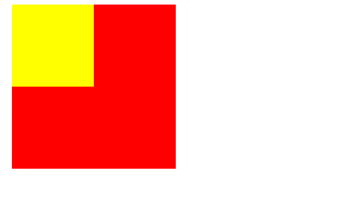

# CSS中的包含块

在css中元素的大小和位置是由 **Containing Block(包含块)** 决定的。在大多数情况下，一个元素的包含块是离它最近的block级的盒子的 **content区域** 。        
比如：
```html
 <style>
  body {
    padding: 0;
    margin: 0;
  }
  .parent {
    height: 100px;
    width: 100px;
    background-color: red;
  }

  .child {
    width: 50%;
    height: 50%;
    background-color: yellow;
  }
</style>
<div class='grandparent'>
  <div class="parent">
    <div class="child"></div>
  </div>
</div>
```
运行结果：


**Containing Block 的改变由元素的 position 属性决定**

## 1、position:static、relative、sticky
如果 position 值为 static、relative、sticky，那么它的 Containing Block 就是离它最近的祖先块级元素的  **Content 区域** 。
## 2、position:absolute
如果 position 值为 absolute，它的 Containing Block 就是离它最近的 position 的值不是 static （也就是值为 fixed, absolute, relative 或 sticky）的祖先元素的  **Padding 区域** 。       
比如：
```html
 <style>
  body {
    padding: 0;
    margin: 0;
  }

  .grandparent {
    width: 300px;
    height: 300px;
    background-color: green;
    position: absolute;
    padding: 50px;
  }

  .parent {
    height: 100px;
    width: 100px;
    background-color: red;
  }

  .child {
    position: absolute;
    width: 10%;
    height: 10%;
    background-color: yellow;
  }
</style>
```
这个例子中，div.child 的 width 为 div.grandparent 的 (width + paddingleft + paddingright) = (300+50+50)*10%=40px，height 同理。

## 3、position:fixed
如果 position 值为 fixed， Containing Block 是 **viewport**。

## 4、position 值为 absolute 或 fixed 的特殊情况
元素有以下特性时，会改变子元素的 **所属包含块**。
- 4.1 transform 或 perspective 的值不是 none       
> 什么意思呢？        
我们把第二点中 position 值为 absolute 的例子改一下，给 parent 增加 transform: translate(20px, 20px);, 这个时候 child 的 Containing Block 就是 parent 了，width 和 height 都为 10px。
- 4.2 will-change 的值是 transform 或 perspective
- 4.3 filter 的值不是 none 或 will-change 的值是 filter（只在 Firefox 下生效）
- 4.4 contain 的值是 paint（例如：contain: paint;）
- 4.5 backdrop-filter 的值不是 none（例如：backdrop-filter: blur(10px);）
