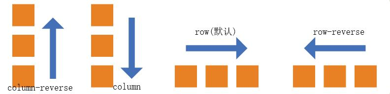
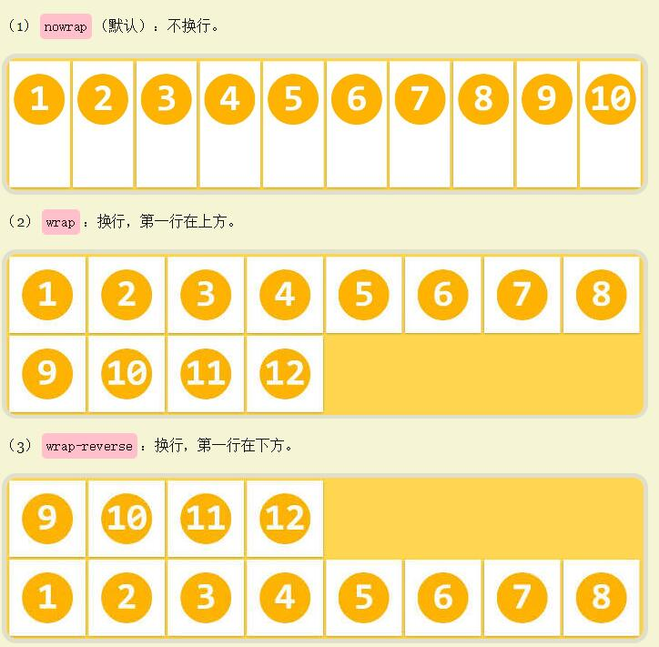
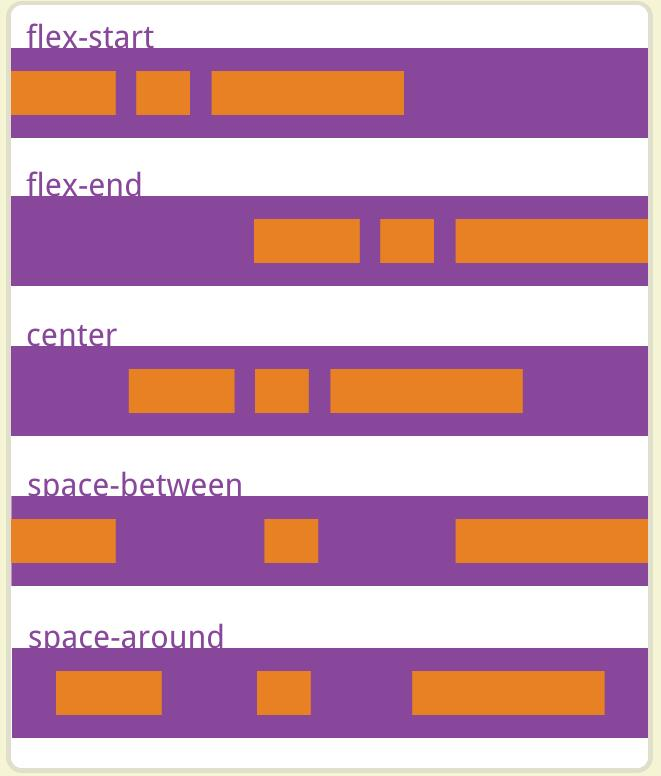
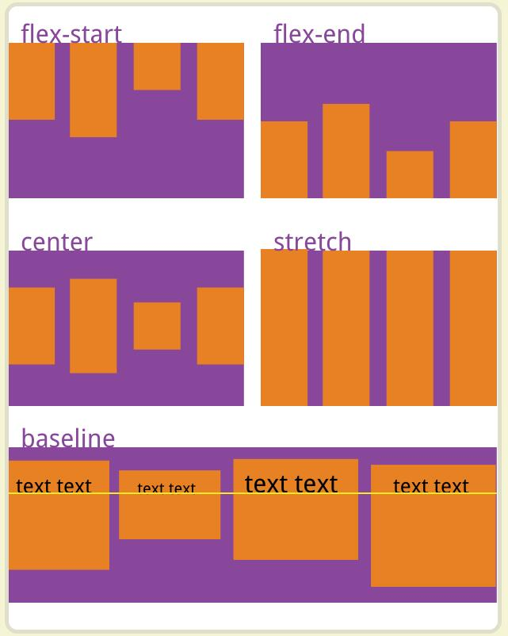
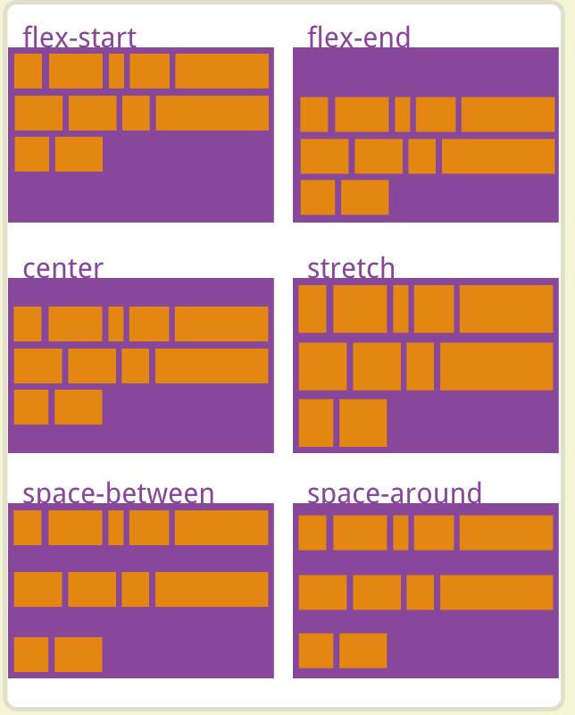
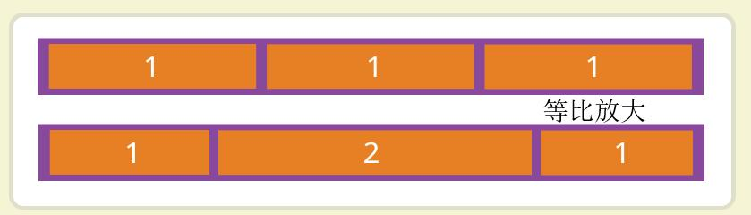
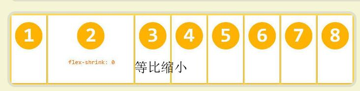
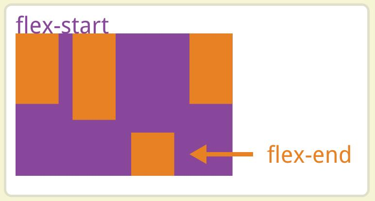

# Flex布局

详情参阅[阮一峰-Flex布局教程](http://www.ruanyifeng.com/blog/2015/07/flex-grammar.html?^%$)

## Flex布局是什么？

弹性布局，容器设置`display`为`flex`或`inlne-flex`即指定为flex布局。

```html
.box{
    display:flex;
}
```

:::tip 提示

设为flex布局后，直接子元素的`float`、`clear`、`vertical-align`属性都将失效。

:::

## 容器的属性

以下6个属性设置在容器上。

```markdown
- flex-direction
- flex-wrap
- flex-flow==>flex-direction和flex-wrap的简写形式
- justify-content
- align-items
- align-content
```

<br/>

### flex-direction
- **`flex-direction`:决定主轴的方向（即项目排列的方向）。常用**
  
  ```css
  .box{
      flex-direction: row | row-reverse | column | column-reverse;
  }
  /*属性介绍*/
  row（默认值）：主轴为水平方向，起点在左端。
  row-reverse：主轴为水平方向，起点在右端。
  column：主轴为垂直方向，起点在上沿。
  column-reverse：主轴为垂直方向，起点在下沿。
  ```
  
      
  
  <br/> <br/>

### flex-wrap
- **`flex-wrap`:默认情况下，项目都排在一条轴线上。该属性定义一条轴线排不下时，如何换行。**
  
  ```css
  .box{
    flex-wrap: nowrap | wrap | wrap-reverse;
  }
  
  /*属性介绍*/
  nowrap(默认)：不换行。
  wrap：换行，第一行在上方，即常规的换行。
  wrap-reverse：换行，第一行在下方。
  ```
  
  
  <br/> <br/>

### justify-content
- **`justify-content`：定义项目在主轴上的对齐方式。常用**
  
  ```css
  .box {
    justify-content: flex-start | flex-end | center | space-between | space-around;
  }
  
  /*属性介绍*/
  flex-start（默认值）：左对齐
  flex-end：右对齐
  center： 居中
  space-between：两端对齐，项目之间的间隔都相等。
  space-around：每个项目两侧的间隔相等。所以，项目之间的间隔比项目与边框的间隔大一倍。
  ```
  
  
  <br/> <br/>

### align-items
- **`align-items`:定义项目在交叉轴上的对齐方式。**
  
  ```css
  .box {
    align-items: flex-start | flex-end | center | baseline | stretch;
  }
  
  /*属性介绍*/
  flex-start：交叉轴的起点对齐。
  flex-end：交叉轴的终点对齐。
  center：交叉轴的中点对齐。
  baseline: 项目的第一行文字的基线对齐。
  stretch（默认值）：如果项目未设置高度或设为auto，将占满整个容器的高度。
  ```
  
  

<br/> <br/>

### align-content
- **`align-content`:属性定义了多根轴线的对齐方式。如果项目只有一根轴线，该属性不起作用。**
  
  ```css
  .box {
    align-content: flex-start | flex-end | center | space-between | space-around | stretch;
  }
  
  /*属性介绍*/
  flex-start：与交叉轴的起点对齐。
  flex-end：与交叉轴的终点对齐。
  center：与交叉轴的中点对齐。
  space-between：与交叉轴两端对齐，轴线之间的间隔平均分布。
  space-around：每根轴线两侧的间隔都相等。所以，轴线之间的间隔比轴线与边框的间隔大一倍。
  stretch（默认值）：轴线占满整个交叉轴。
  ```
  
  
  <br/> <br/>

## 项目的属性

以下6个属性设置在项目上。

```markdown
- order
- flex-grow
- flex-shrink
- flex-basis
- flex
- align-self
```

<br/>

### flex-grow
`flex-grow`属性定义项目的放大比例，默认为`0`，即如果存在剩余空间，也不放大。
    
  

### flex-shrink
`flex-shrink`属性定义了项目的缩小比例，默认为1，即如果空间不足，该项目将缩小。
  
  

### flex-basis
 `flex-basis`属性定义了在分配多余空间之前，项目占据的主轴空间。
- 浏览器根据这个属性，计算主轴是否有多余空间。它的默认值为`auto`，即项目的本来大小。

### flex
- **`flex`:`flex-grow`、`flex-shrink`、`flex-basis`的简写形式，默认值为`0 1 auto`。**

<br/>

### align-self
- **`align-self`:该属性允许单个项目在交叉轴上有不一样的对齐方式，可覆盖`align-items`的属性。**
  
  ```css
  .item {
    align-self: auto | flex-start | flex-end | center | baseline | stretch;
  }
  
  /*属性介绍：同align-items一样*/
  auto:表示继承align-items的属性值。（默认值）
  ```
  
  
